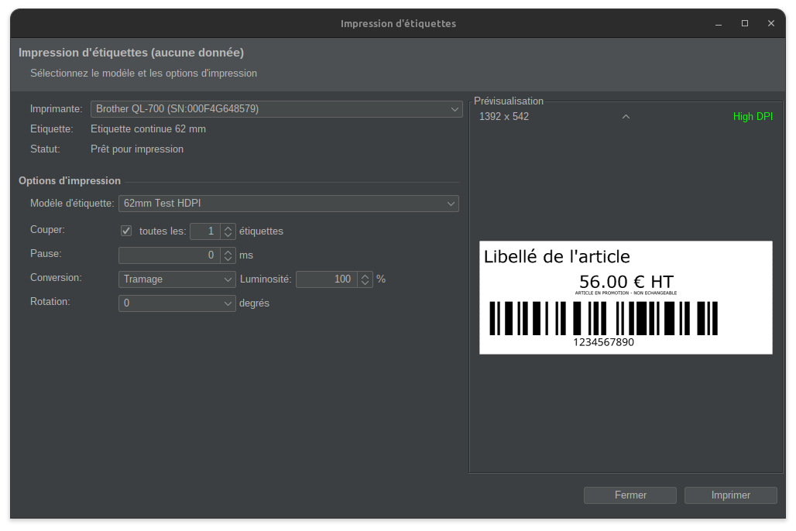

# Module OpenConcerto d'impression d'étiquettes sur imprimante USB Brother QL

Ce projet est un plugin pour l'ERP OpenConcerto permet l'impression d'étiquettes d'articles sur les imprimantes USB Brother QL.
Son but est de pouvoir exploiter toutes les capacités de ces imprimantes, en particulier de pouvoir imprimer des étiquettes
de tailles variables sur les rouleaux continus.

Le module a été développé en Java, et en premier à destination d'un système d'exploitation Gnu/Linux, mais peut fonctionner sur d'autres systèmes.

Il se base sur les librairies :
- [libusb](https://libusb.info/) pour l'interfaçage natif avec les périphériques USB
- [usb4java](http://usb4java.org/) pour l'intégration de libusb avec Java
- [OkapiBarcode](https://github.com/woo-j/OkapiBarcode) pour la génération de codes barres

Le module est sous license GNU General Public License v3.0.

Développeur : Cédric de Launois
                           



# Imprimantes supportées

Le code a été testé avec une imprimante Brother QL-700, mais il devrait fonctionner avec les imprimantes suivantes :

- Brother QL-500
- Brother QL-550
- Brother QL-560
- Brother QL-570
- Brother QL-580N
- Brother QL-650TD
- Brother QL-700
- Brother QL-700M
- Brother QL-1050
- Brother QL-1060N
        
# Téléchargement

- [org.delaunois.openconcerto.label.brotherql-1.0.jar](dist/org.delaunois.openconcerto.label.brotherql-1.0.jar)

# Installation

Le module s'installe comme tout module OpenConcerto, en le copiant dans le répertoire des modules puis en l'activant 
via l'interface de gestion des modules.

## Linux

Sur Linux, l'accès à l'imprimante demande des droits USB en lecture et écriture.
En cas de permission insuffisante, il peut être nécessaire d'ajouter une règle udev, de la façon suivante :

- Créer une nouvelle règle udev : 
```
sudo vi /etc/udev/rules.d/50-brotherusb.rules
```
- Ecrire dans le fichier (par exemple) la règle suivane : 
```
SUBSYSTEMS=="usb", ATTRS{idVendor}=="04f9", MODE="0666"`
```
- Recharger les règles : 
```
sudo udevadm control --reload
```

# Compilation depuis les sources

Le module se compile avec [Maven](https://maven.apache.org/).
L'API d'interfaçage avec OpenConcerto n'étant pas diponible en tant que librairie Java dans Maven Central, 
la compilation nécessite la présence du jar [openconcerto](https://www.openconcerto.org/fr/telechargement.html) 1.7.4 dans le repository Maven local.
Pour l'y ajouter, téléchargez le jar `OpenConcerto.jar` puis lancez la commande suivante :
```
mvn install:install-file -Dfile=lib/OpenConcerto.jar -DgroupId=org.openconcerto -DartifactId=openconcerto -Dversion=1.7.4  -Dpackaging=jar -DgeneratePom=true
```

Le module se compile ensuite avec la commade Maven : `mvn package`
